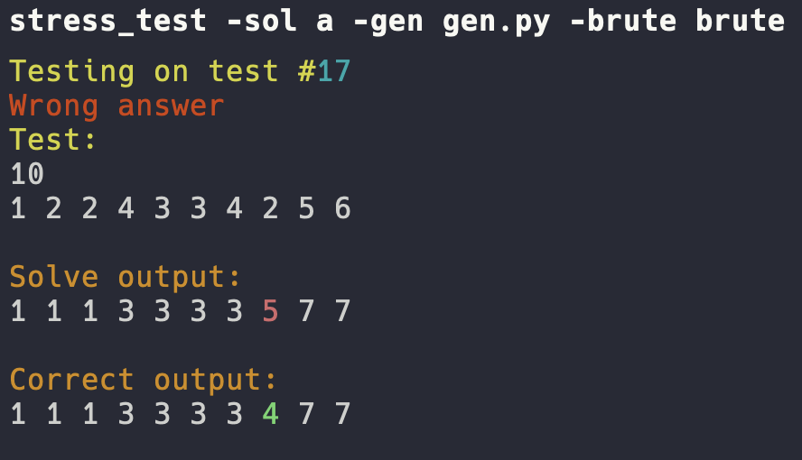

# Competitive programming scripts

Scripts for testing solutions, parsing problems or contests and so on.

## Contests parsing

There are two options for parsing the contest:

- Install html of the contest yourself and parse the installed file (preferred way, if the contest is live):
```shell
setup_contest -html ~/Downloads/contest.html -title cf1637
```
- Specify the link (for codeforces the link should point to `/problems` page, for atcoder - to `tasks_print` page):
```shell
setup_contest -url https://codeforces.com/contest/1637/problems
setup_contest -url https://atcoder.jp/contests/agc010/tasks_print
```


## Problems parsing

As well as for the contest parsing there are two options:
- Install html of the problem yourself and parse the installed file:
```shell
setup_problem -html ~/Downloads/problem.html -index H
```
- Specify the link:
```shell
setup_problem -url https://codeforces.com/contest/1637/problem/H
setup_problem -url https://atcoder.jp/contests/agc010/tasks/agc010_f
```


## Compilation and problems testing

There are scripts to compile or test in debug mode: `cmpl` and `bld` as well as to compile ans test in release mode: `fcmpl` and `fbld`. Also `drun` is used to test the solution without compilation.

Compilation and testing `main.cpp`:
```shell
cmpl main
bld main
fcmpl main
fbld main
drun main
```


## Stress testing

To stress test your solution you need to implement generator and correct solution. All of them must be executable (i. e. already compiled). For example:
```shell
stress_test -sol main -gen gen.py -brute brute
```


## Testing interactive problems

To test interactive problem you need to implement interactor. For example:
```shell
interact -sol main -int interactor -input in1
```


## Instalation or settings update

Before instalation set your own settings inside `settings.py`.

Inside `debug` section there are settings used for `bld` and `cmpl`. Inside `release` selction there are similar settings used for `fbld` and `fcmpl`.

Also it is possible to set which files and directories should be created when executing `setup_problem` or `setup_contest`. `problem_files` are created inside each problem directory and `contest_files` are created inside the contest directory.

```shell
chmod +x install.sh
./install.sh
```

In case `PATH` warning is throwed, you need to add `/home/username/.local/bin` (actual path must be mentioned in the warning) to the `PATH`:
```shell
PATH="/home/username/.local/bin":"$PATH"
```
